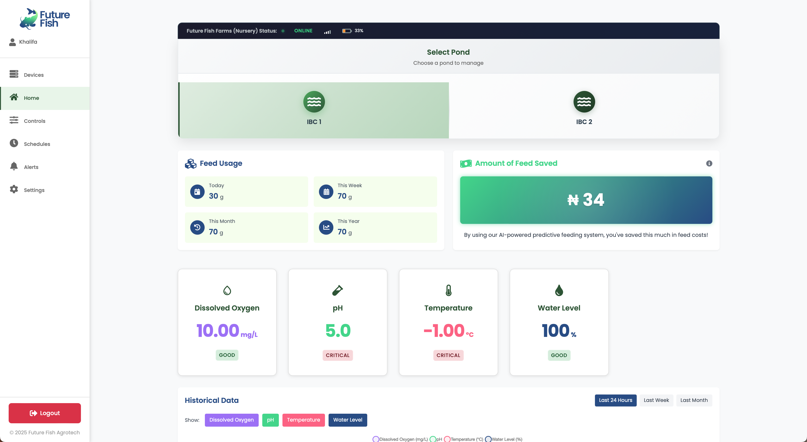
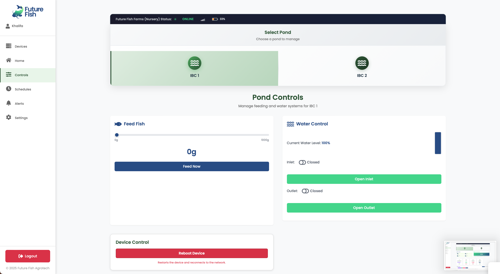

# Future Fish Dashboard (Aquaculture Automation System — Backend + Ops Brief)

Future Fish Dashboard is an **aquaculture automation system** that enables operators to:

- **Monitor ponds** using continuous sensor telemetry (water level, feed level, temperature, water quality parameters, device health)
- **Execute control actions** (feeding, water control, threshold updates, reboot, firmware commands) and track each action end-to-end
- **Automate operations** using schedules and thresholds (with execution history and outcomes)
- **Verify outcomes** using device acknowledgements and completion messages (ACK/COMPLETE), with timeout and retry handling
- **Maintain an audit trail** across telemetry, commands, automation executions, and alerts

This document is a project brief and operational README describing capabilities, system architecture, and integration surfaces.

---

## Primary user workflows

- **Onboard devices and ponds**: register pond controller devices (`PondPair`), add one or two ponds per device, and generate QR labels for device identification.
- **Monitor live operations**: view sensor telemetry, device heartbeat/health, and active alerts.
- **Control equipment**: issue manual commands for feeding and water control, as well as reboot, firmware, and threshold commands.
- **Automate operations**: configure schedules and thresholds; review execution outcomes and failures.
- **Review history and performance**: audit command history and alerts; access historical telemetry and analytics summaries.

---

## Screenshots

### Dashboard view (monitoring and analytics)



### Controls view (manual control and device actions)



---

## Capabilities

- **Asset-style identification for hardware**
  - Each pond controller is registered as a `PondPair` with a unique **MAC-address device ID**.
  - The platform includes an **admin-only QR generator** to print QR labels for device IDs (scan-to-identify in the field).

- **Continuous telemetry ingestion**
  - Sensor payloads are received over **MQTT** and stored as structured `SensorData` with indexes for time-range queries.
  - Supports multiple sensor parameters (e.g., temperature, water/feed levels, turbidity, dissolved oxygen, pH, ammonia, battery, signal strength).

- **Automation and control loop with full traceability**
  - Operators and automation rules can issue commands (feed, water actions, thresholds, reboot, firmware) via API.
  - Commands are persisted as `DeviceCommand` records and tracked through lifecycle states:
    - `PENDING → SENT → ACKNOWLEDGED → EXECUTING → COMPLETED/FAILED/TIMEOUT`
  - Devices respond using a two-phase pattern:
    - **ACK**: received the command
    - **COMPLETE**: finished executing it

- **Automation engine (rules, schedules, and thresholds)**
  - Threshold definitions (`SensorThreshold`) support actions when readings drift out of bounds.
  - Scheduled automations (`AutomationSchedule`) execute actions at configured times/days.
  - Each run is stored as an `AutomationExecution` (success/failure, timing, parameters).

- **Real-time operator status updates**
  - Server-Sent Events (SSE) streams provide near real-time updates for:
    - Individual command status streams
    - A unified dashboard stream (device status + sensor updates + command updates + alerts)
  - A polling endpoint exists as a fallback when streaming is not available.

---

## Operational model

Aquaculture automation depends on two kinds of truth:

- **State**: What is happening in the ponds right now? (water level, feed levels, temperature, etc.)
- **History**: What happened, when, and who/what triggered it? (commands sent, acknowledgements, failures, threshold violations)

Future Fish Dashboard keeps both truths so automation can be trusted:

- **A digital identity** for each physical controller device (a `PondPair`, keyed by a MAC-style `device_id`)
- **A timestamped activity trail** for sensor readings, commands, automation executions, and alerts

That combination—**identity + logs + resilience**—is a foundation for field operations systems that track equipment, actions, compliance, or workforce accountability.

---

## Operational constraints addressed

This system addresses common constraints in field-deployed automation and telemetry systems:

- **Intermittent connectivity is normal**
  - Devices lose Wi‑Fi, reconnect, and sometimes need a fallback configuration mode.
  - Real-time dashboards must degrade gracefully (streaming when possible, polling when not).

- **Automation must be provable, not just sent**
  - If the device never received the command, or received it but did not execute it, the platform must be able to prove where it failed.
  - Every control action needs a verifiable trail: request → publish → ACK → COMPLETE (or TIMEOUT).

- **Identity is the root of accountability**
  - Without reliable identification of the physical unit responsible for an action, trustworthy operational histories cannot be produced.
  - QR codes / labels are the practical glue between the physical world and the database.

- **Telemetry pipelines must scale and stay maintainable**
  - Sensor readings are constant streams; the web API cannot be tightly coupled to broker connections.
  - Data must be indexed, routable, and easy to process asynchronously (threshold checks, alerts, analytics).

---

## Design rationale

### Connectivity resilience

The system is designed for low-connectivity environments across device, backend, and operator interfaces:

- **Device-side resilience**: the ESP32 firmware includes explicit Wi‑Fi reconnection logic and an AP/captive-portal style fallback when connectivity fails.
- **Backend-side resilience**:
  - Command timeouts + retries (`DeviceCommand.timeout_seconds`, `max_retries`, `retry_count`)
  - Heartbeats + online/offline status (`DeviceStatus.last_seen`, `DEVICE_HEARTBEAT_OFFLINE_THRESHOLD`)
  - Decoupled MQTT processing via Redis (so web workers can restart without killing the MQTT connection)
- **UI-side resilience (integration point)**:
  - Command status is streamed via SSE and falls back to polling when SSE fails.
  - Frontend blocks control actions when device is offline, and communicates last-seen timestamps.

### Hardware–software handshake (QR, identity, command verification)

This system shows a complete handshake from physical hardware to persisted records:

- **Identity**:
  - `PondPair.device_id` is the hardware identity (MAC-style string).
  - `qr_generator/` produces QR labels for device IDs (admin-only), enabling scan-to-identify workflows.
- **Targeting**:
  - `Pond.position` provides stable addressing (pond 1 vs pond 2) within a device (one controller supports up to two ponds).
  - Commands carry targeting metadata (e.g., pond position) so the device executes the right actuator.
- **Verification**:
  - The device responds with **ACK** and **COMPLETE** messages, which update persisted `DeviceCommand` records.
  - The platform streams those status transitions back to the operator (SSE) for immediate feedback.

### Scalable data pipelines (telemetry and commands)

The backend is structured like a production telemetry system:

- **MQTT ↔ Django decoupling**: Redis pub/sub bridge (`mqtt_outgoing`, `mqtt_incoming`)
- **Asynchronous processing**: Celery workers handle ingestion-side work (message processing, threshold checks, cleanup) outside request/response
- **Data model built for time-series**: `SensorData` stores rich readings with indexes for time-range queries and analytics
- **Operational logging**: `MQTTMessage` records payloads and message metadata to debug live systems and quantify reliability

### Operator feedback loop (status and visibility)

The API and streaming endpoints are designed to support field-friendly UI patterns:

- **Immediate feedback**: status transitions are visible as they happen (ACKNOWLEDGED → EXECUTING → COMPLETED)
- **Clear failure modes**: TIMEOUT/FAILED are first-class outcomes, not silent failures
- **Low cognitive load**: device online status is derivable from heartbeats; the UI can prevent actions when devices are offline

### Evidence in repository documentation

Key documentation entry points:

- `docs/ARCHITECTURE.md` (system overview, services, data flow)
- `docs/MQTT_BRIDGE_IMPLEMENTATION.md` (Redis bridge design and responsibilities)
- `docs/MQTT_CONTROL_FLOW.md` (button click → API → MQTT → ACK/COMPLETE lifecycle)
- `docs/POND_PAIR_API_DOCS.md` (device identity model + endpoints)
- `docs/PRODUCTION_DEPLOYMENT_GUIDE.md` (env, services, health checks)

And at the repository root (outside this folder):

- `COMMAND_MANAGEMENT_AUDIT_TRAIL.md` (end-to-end: frontend → backend → mqtt → firmware → SSE feedback)
- `WIFI_RECONNECTION_ANALYSIS.md` (connectivity resilience considerations on the ESP32 side)

---

## Architecture overview

The system is intentionally modular, separating the web API from high-frequency device messaging.

```
IoT Device (ESP32) ↔ MQTT Broker ↔ MQTT Service Process
                               ↕
                            Redis Pub/Sub
                               ↕
                        Django API + DB (SensorData, Commands, Alerts)
                               ↕
                        Celery workers + Celery Beat schedules
                               ↕
                           Operator UI (React/Vite SPA)
```

### Why the Redis bridge exists

Instead of running the MQTT client inside the web process, MQTT traffic is **bridged through Redis**:

- **Outgoing**: Django publishes device command payloads to Redis (`mqtt_outgoing`); the MQTT service publishes to the broker.
- **Incoming**: MQTT service publishes messages to Redis (`mqtt_incoming`); a listener/consumer persists telemetry + updates statuses.

This keeps the system reliable under load and helps isolate MQTT connection concerns from web request lifecycles.

---

## Django applications

This backend is intentionally modular. Each Django app has a narrow responsibility.

### `core/` — platform foundation

- **What it owns**: system-wide constants, choices/enums, health utilities, base patterns used everywhere
- **Key endpoints**:
  - `GET /api/health/` (service health + dependency checks)
- **Why it matters**: makes the system operable in production (health checks, consistent constants, shared behavior)

### `users/` — authentication + account boundaries

- **What it owns**: registration/login, JWT auth, profile endpoints, ownership boundaries used for authorization
- **Key endpoints**:
  - `POST /users/register/`
  - `POST /users/login/` (JWT obtain)
  - `POST /users/token/refresh/`
  - `POST /users/logout/`
  - `GET /users/profile/`
- **Why it matters**: access control is enforced at the API layer

### `ponds/` — identity, pond topology, and telemetry storage

- **What it owns**:
  - `PondPair`: device identity (MAC-style `device_id`) and ownership
  - `Pond`: pond definitions + the position mapping (1 or 2) used for targeted device control
  - `SensorData`: time-series telemetry persistence with indexes
  - `SensorThreshold` + `Alert`: threshold definitions and alert history
- **Key endpoints (PondPair lifecycle)**:
  - `GET/POST /ponds/`
  - `GET /ponds/<id>/details/`
  - `POST /ponds/<pond_pair_id>/add-pond/`
  - `DELETE /ponds/<pond_pair_id>/remove-pond/<pond_id>/`
- **Why it matters**: this is the database truth layer that makes auditability and identity possible

### `automation/` — automation engine + device control API + real-time streaming

- **What it owns**:
  - `AutomationSchedule`: time-based rules (feed/water schedules)
  - `AutomationExecution`: execution history (what ran, why, and outcome)
  - `DeviceCommand`: command persistence + retries/timeouts + status lifecycle
  - API endpoints for manual control and automation management
  - SSE endpoints to stream command status + unified dashboard updates
- **Key endpoints (control + status)**:
  - `POST /automation/ponds/<pond_id>/control/feed/`
  - `POST /automation/ponds/<pond_id>/control/water/`
  - `POST /automation/ponds/<pond_id>/control/reboot/`
  - `GET /automation/commands/<command_id>/stream/` (SSE)
  - `GET /automation/commands/<command_id>/status/` (polling fallback)
  - `GET /automation/dashboard/<pond_id>/unified-stream/` (SSE)
- **Why it matters**: this is where monitoring, decisioning, action, and verification become a reliable control loop

### `mqtt_client/` — MQTT bridge, message ingestion, and device status

- **What it owns**:
  - Redis bridge (`mqtt_outgoing`, `mqtt_incoming`) to decouple MQTT from web workers
  - MQTT service process and listener commands
  - Message consumer that persists sensor data and updates command statuses (ACK/COMPLETE)
  - Device status (`DeviceStatus`) and MQTT logging (`MQTTMessage`)
- **Key management commands**:
  - `python manage.py start_mqtt_client [--daemon]`
  - `python manage.py listen_mqtt_incoming [--daemon]`
- **Why it matters**: this is the always-on comms layer—reliability, backpressure, observability

### `analytics/` — reporting + historical views

- **What it owns**: endpoints for feed stats/history and historical data access patterns
- **Key endpoints**:
  - `GET /analytics/feed-stats/`
  - `GET /analytics/feed-history/`
  - `GET /analytics/ponds/<pond_id>/historical-data/`
- **Why it matters**: turns raw telemetry + events into summaries that operators can act on

### `qr_generator/` — QR label generation for device identity

- **What it owns**: admin-only QR generation for `device_id` labels (stored under `media/qr_generator/...`)
- **Key routes**:
  - Served under `/qr-generator/` (staff-only views)
- **Why it matters**: it is the pragmatic bridge between a physical device and the database record

### `api/` — reserved for versioned routing / future expansion

- Present to preserve structure for API versioning under `/api/v1/` (currently minimal routing).

---

## Core concepts (the mental model)

- **`PondPair`**: the *identity record* for a physical controller device (keyed by `device_id`, a MAC-style string).
- **`Pond`**: a logical pond belonging to a `PondPair`. A pair supports up to 2 ponds with consistent positions.
- **`SensorData`**: time-series telemetry persisted for analytics, monitoring, and audit.
- **`DeviceCommand`**: a persisted instruction to hardware (with retries/timeouts, ACK/COMPLETE timestamps).
- **`AutomationExecution`**: an execution record tying the reason an action happened (manual/scheduled/threshold) to device commands.
- **`DeviceStatus`**: online/offline heartbeat and device metadata (firmware, Wi-Fi strength, heap, etc.).
- **`MQTTMessage`**: message logging for debugging and operational visibility.
- **`QRCodeGeneration`**: admin-generated QR labels for device identification.

This structure supports scan-to-identify workflows and auditable operational histories.

---

## End-to-end flows

### 1) Device onboarding: register + label

1. Create a `PondPair` with a valid `device_id` (MAC address format).
2. Add 1–2 `Pond` records to the pair.
3. Generate a QR code label containing the device ID (`/qr-generator/` in admin context).
4. Attach the QR label to the hardware for fast field identification.

### 2) Telemetry ingestion: sensors → database

1. Device publishes sensor payloads on MQTT topics.
2. MQTT service forwards messages into Redis (`mqtt_incoming`).
3. Consumer stores a `SensorData` record and triggers threshold checks (Celery).
4. Unified SSE stream can push updates to the UI in near real-time.

### 3) Control: button click → command → ACK → COMPLETE → history

1. Operator triggers an action (feed, water, reboot, firmware, threshold update).
2. Django creates a `DeviceCommand` and publishes to Redis (`mqtt_outgoing`).
3. MQTT service publishes to the device’s MQTT topic.
4. Device responds with:
   - ACK (receipt)
   - COMPLETE (execution result)
5. The platform updates `DeviceCommand`, links to `AutomationExecution` where applicable, and logs it for audits/analytics.

---

## Scope

This folder (`Future-Fish-Dashboard/`) contains the **Django backend** and operational services:

- Django REST API (authentication, ponds, automation, analytics, monitoring)
- MQTT bridge + MQTT service management commands
- Celery workers + Celery beat schedules
- QR generator (admin-only) for device ID labels
- Swagger/OpenAPI docs (`/swagger/`, plus YAML exports)

The operator UI is described as a **React/Vite SPA**. In this repository, the Django template (`templates/index.html`) is wired to a Vite dev server (`http://localhost:5173`) for development; built assets under `static/dist/` are not present here.

In the broader repository (outside this folder), there is also:

- A React frontend (`FutureFish-Frontend/`) that integrates with these APIs and uses SSE + polling fallback for command status.
- ESP32 firmware (`IoTFirmware/`) that implements command execution and connectivity resilience (reconnect + configuration fallback).

---

## API overview

### Authentication

Most endpoints use **JWT Bearer auth**:

- `Authorization: Bearer <token>`

Key routes:

- `POST /users/register/`
- `POST /users/login/`
- `POST /users/token/refresh/`
- `POST /users/logout/`

### Pond & device identity (asset-style records)

`PondPair` management:

- `GET/POST /ponds/`
- `GET /ponds/summary/`
- `GET/PATCH/DELETE /ponds/<id>/`
- `GET /ponds/<id>/details/`
- `GET /ponds/device/<device_id>/`
- `POST /ponds/<pond_pair_id>/add-pond/`
- `DELETE /ponds/<pond_pair_id>/remove-pond/<pond_id>/`

### Automation & device control

- `POST /automation/ponds/<pond_id>/control/feed/`
- `POST /automation/ponds/<pond_id>/control/water/`
- `POST /automation/ponds/<pond_id>/control/threshold/`
- `POST /automation/ponds/<pond_id>/control/reboot/`
- `POST /automation/ponds/<pond_id>/control/firmware/`

### Real-time status (SSE) + fallback polling

- **Single-command SSE stream**: `GET /automation/commands/<command_id>/stream/`
- **Single-command polling**: `GET /automation/commands/<command_id>/status/`
- **Unified dashboard SSE stream**: `GET /automation/dashboard/<pond_id>/unified-stream/`

### Documentation (Swagger)

- Swagger UI: `/swagger/`
- OpenAPI JSON: `/swagger.json`
- OpenAPI YAML: `/swagger.yaml` (plus `docs/swagger_*.yaml`)

---

## Local development

### Prerequisites

- Python 3.x
- Redis (required for Celery + MQTT bridge)
- An MQTT broker reachable from your environment (host/port configured via env)

### Environment variables

1. Copy the template:

```bash
cp env.template .env
```

2. Set at minimum:

- **Django**: `SECRET_KEY`, `DEBUG`, `DJANGO_SETTINGS_MODULE`
- **Redis/Celery**: `CELERY_BROKER_URL`, `CELERY_RESULT_BACKEND`
- **MQTT**: `MQTT_BROKER_HOST`, `MQTT_BROKER_PORT`, `MQTT_USERNAME`, `MQTT_PASSWORD`

Security: rotate any default credentials and never commit `.env` files.

### Core processes (what must run)

In production, these run as separate services/containers:

- **Django web** (API + admin + swagger)
- **Celery worker**
- **Celery beat**
- **MQTT client service** (`start_mqtt_client`)
- **MQTT incoming listener** (`listen_mqtt_incoming`)

`railway.json` shows a typical multi-service setup (web + worker + beat + MQTT services + Redis + PostgreSQL).

---

## Management commands

### MQTT services

- `python manage.py start_mqtt_client [--daemon]`
- `python manage.py listen_mqtt_incoming [--daemon]`
- `python manage.py connect_mqtt`
- `python manage.py fix_stuck_commands`
- `python manage.py generate_device_jwt_tokens`

### Data generation

- `python manage.py generate_dummy_sensor_data <pond_id> [--clear] [--days N]`

### Celery health helpers

- `python manage.py start_celery_worker_with_health`
- `python manage.py start_celery_beat_with_health`
- `python manage.py celery_worker_health`
- `python manage.py celery_beat_health`

---

## Monitoring and reliability

- **Health check**: `GET /api/health/`
  - Includes checks for Django, DB, Redis, and informational checks for MQTT/celery services (via Redis heartbeats).

- **Operational audit trail**
  - `DeviceCommand`: every command, status transitions, and timing
  - `AutomationExecution`: every automation run (manual/scheduled/threshold)
  - `MQTTMessage`: payload logging for debugging message flows

This structure supports fast answers to operational questions:

- Did the device receive the command?
- Did it complete it?
- What was the last known heartbeat and signal strength?
- What readings triggered an alert?

---

## Repository structure

- **`ponds/`**: pond/device identity + sensor storage
- **`automation/`**: thresholds, schedules, executions, SSE streams
- **`mqtt_client/`**: Redis bridge, MQTT service, message consumer, command tracking
- **`analytics/`**: feed stats + historical data endpoints
- **`users/`**: JWT auth + profile
- **`qr_generator/`**: admin QR label generation for device IDs
- **`docs/`**: architecture notes, MQTT flow docs, deployment guides, swagger exports

---

## License

Internal project. Add licensing terms if distribution or open-source release is planned.


